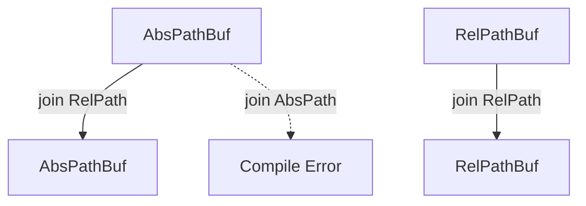

# RelAbs: Typed Paths for Rust

[](https://crates.io/crates/relabs)
[](https://docs.rs/relabs)

[](https://github.com/fbinkert/relabs/actions)
[](https://crates.io/crates/relabs)

`RelAbs` enforces path invariants in the type system. It prevents directory traversal bugs and logic errors by ensuring you never accidentally join an absolute path onto a relative base.

> ⚠️ **Status: Active Development**
> This crate is currently in the early stages of development. APIs are subject to change.

## Motivation

Standard Rust paths (`std::path::PathBuf`) are semantically dynamic: push behaves differently depending on whether the input is absolute or relative.

```rust
use std::path::PathBuf;

fn build(user_input: PathBuf){
  let mut path = PathBuf::from("/var/www");
  // If this string is absolute, it replaces the base.
  // If it is relative, it appends.
  path.push(user_input);
  }
```

While this flexibility is often useful, it prevents the compiler from verifying your intent. If you expect a path to always be relative or always be absolute, `std::path` cannot enforce this invariant for you.

`RelAbs` lifts these invariants into the type system. It distinguishes between **replacing** a path (via `replace_with` or `push_std`) and extending a path (via `push`), making your logic explicit and verified at compile time.

```rust
use relabs::{AbsPathBuf, RelPath};

let mut path = AbsPathBuf::try_from("/var/www").unwrap();

// Compile Error: `push` only accepts `RelPath`.
// This prevents accidental replacement of the base path.
// path.push("/etc/passwd"); 

// You must strictly push relative paths:
path.push(RelPath::try_new("static/style.css").unwrap());
```

## Installation

Run the following Cargo command in your project directory:

```bash
cargo add relabs
```

## Usage

### Zero-Cost Flavors

`RelAbs` provides three path flavors. All are `#[repr(transparent)]` wrappers around `std::path::Path/PathBuf` with zero runtime overhead.

| Types| Guarantee |
| --- | --- |
| `AbsPath`, `AbsPathBuf` | Path is absolute (starts with `/` or `C:\`). |
| `RelPath`, `RelPathBuf` | Path is relative (no root prefix). |
| `AnyPath`, `AnyPathBuf` | No guarantee ( alias for `std::path::Path`). |

### Construction

Validation happens only once at the boundary (construction). Host OS rules apply.

```rust
use relabs::{AbsPathBuf, RelPathBuf};

// Using TryFrom
let root = AbsPathBuf::try_from("/usr/local").unwrap();

// Using Parse (FromStr)
let config: RelPathBuf = "config/app.toml".parse().unwrap();
let logs: AbsPathBuf = "/var/log".parse().unwrap();

// Error Handling:
// Cannot create RelPath from an absolute string
assert!(RelPathBuf::try_from("/etc/hosts").is_err());
```

### Self-Documenting Signatures

Stop writing documentation like "Note: `base` must be absolute." Let the type system enforce it.

```rust
use relabs::{AbsPath, RelPath};

fn deploy(destination: &AbsPath, assets: &RelPath) {
    // It is impossible to call this function with mixed-up paths.
    let target = destination.join(assets);
}
```

## Typed Composition

You can only `join` or `push` a relative path onto a base.



If you really need the standard library behavior (where absolute paths replace the base), use the explicit escape hatch `push_std`:

```rust
use relabs::AbsPathBuf;
let mut path = AbsPathBuf::try_from("/usr/local").unwrap();

// Explicitly opt-in to replacement semantics
path.push_std("/new/root");
```

### Comparison

| Feature | **RelAbs** | `std::path` | `camino` | `relative-path` | `abs_path` |
| :---: | :---: | :---: | :---: | :---: | :---: |
| **Scope** | **Unified (Abs & Rel)** | Unified (dynamic) | Unified (UTF-8) | Relative Only | Absolute Only |
| **Encoding** | **OS-native** | OS-native | UTF-8 only | UTF-8 | OS-native |
| **Safety** | **Compile-time** | Runtime checks | Runtime checks | Compile-time | Compile-time |
| **Integration** | **Zero-cost Wrapper** | N/A | Wrapper | Virtual Type | Wrapper |

**Why `RelAbs?`**

* **vs. `std::path`**: `RelAbs` enforces path direction (absolute vs. relative) in the type system, preventing logic errors where a path is assumed to be one or the other.
* **vs. `camino`**: `RelAbs` focuses on **absolute/relative validation**, whereas `camino` focuses on **UTF-8 encoding**. `RelAbs` wraps `std::path` and supports non-UTF-8 OS paths.
* **vs. `relative-path`/`abs_path`**: These crates solve half the problem each. `RelAbs` provides a unified system where you can safely join a `RelPath` onto an `AbsPath` to get a new `AbsPath`.

## Safety & Internals

`RelAbs` relies on unsafe only for the zero-cost conversion methods (e.g., `&Path` to `&AbsPath`). This is sound because:

* All types are `#[repr(transparent)]`.
* Constructors strictly validate invariants before casting.
* Mutation methods (like push) enforce invariants to prevent the underlying buffer from becoming invalid.

## Roadmap

* [ ] `Serde` support (Deserialize/Serialize with validation).
* [ ] Complete `std::path::Path` API parity (metadata, ancestors, etc.).
* [ ] Test with Miri.
* [ ] Display and Debug implementations that respect flavors.
* [ ] Windows/Unix specific extensions.

## License

MIT
