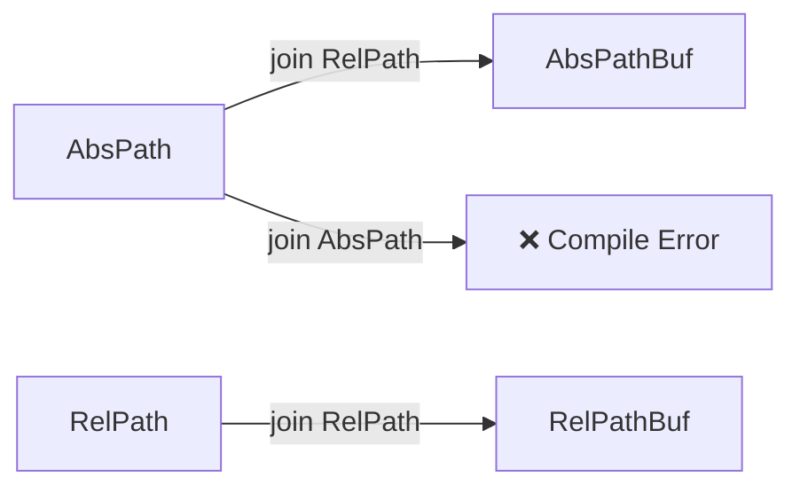

# RelAbs: The Typed Path Crate for Rust

[](https://crates.io/crates/relabs)
[](https://docs.rs/relabs)


**Strict, compile-time validation for absolute and relative paths in Rust.**

`RelAbs` lifts the distinction between absolute and relative paths into the type system. It prevents common directory traversal bugs, logic errors, and "stringly typed" confusion by ensuring you never accidentally mix them up.

> ⚠️ **Status: Active Development**
> This crate is currently in the early stages of development. APIs are subject to change.

---

## Installation

Run the following Cargo command in your project directory:

```bash
cargo add relabs
```

---

## Motivation & Comparison

Standard Rust paths (`std::path::Path`/`PathBuf`) are "stringly typed." This ambiguity forces you to rely on repetitive runtime checks or, worse, assume invariants that the compiler cannot enforce. `RelAbs` provides a safer, compile-time guarantee.

### Comparison to Existing Crates

| Feature            |       **RelAbs**       | `std::path`  |   `camino`   |   `relative-path`    |    `abs_path`     |
| :----------------- | :--------------------: | :----------: | :----------: | :------------------: | :---------------: |
| **Type Safety**    | **Strict (Abs & Rel)** |     None     |     None     |  Strict (Rel only)   | Strict (Abs only) |
| **Path Encoding**  |     **OS-native**      |  OS-native   |  UTF-8 only  |        UTF-8         |     OS-native     |
| **Semantics**      |     **OS-native**      |  OS-native   |  OS-native   | POSIX-like (Virtual) |     OS-native     |
| **Unified System** |        **Yes**         | Yes (unsafe) | Yes (unsafe) |          No          |        No         |

- **vs. `camino`:** `RelAbs` focuses on **absolute/relative validation**, whereas `camino` focuses on **UTF-8 encoding**. `RelAbs` wraps `std::path` and supports non-UTF-8 OS paths.
- **vs. `relative-path`/`abs_path`:** These solutions split the problem across separate crates. `RelAbs` provides a **unified system** for both `AbsPath` and `RelPath` with typed transitions between them.

---

## Flavors: Typed Paths

`RelAbs` introduces **flavors** to encode invariants in the type system.

Core types:

- **`AbsPath`, `AbsPathBuf`** – Paths that are guaranteed to be **absolute**.
- **`RelPath`, `RelPathBuf`** – Paths that are guaranteed to be **relative**.
- **`AnyPath`, `AnyPathBuf`** – Unconstrained (analogous to `std::path::Path` / `PathBuf`).

All flavored types are zero-cost, `#[repr(transparent)]` wrappers.

### Constructing Typed Paths

Validation happens at construction. Since `RelAbs` wraps `std::path`, validation uses the **host OS rules** (e.g., `C:\` is absolute on Windows, but not on Linux).

```rust
use relabs::{AbsPath, RelPath, AbsPathBuf, RelPathBuf};

// Fallible construction from &str / &Path
let root: &AbsPath = AbsPath::try_new("/var/www").unwrap();
let rel : &RelPath = RelPath::try_new("static/app.css").unwrap();

// Owned variants
let abs_buf = AbsPathBuf::try_from("/etc/passwd").unwrap();
let rel_buf = RelPathBuf::try_from("src/lib.rs").unwrap();
```

If the invariant doesn’t hold (e.g., constructing `AbsPath` from a relative string), construction fails instead of silently accepting it.

---

## Typed Composition (`push` / `join`)

In the standard library, passing an absolute path to `PathBuf::push` silently **replaces** the base path, which is a common source of logic bugs. `RelAbs` eliminates this bug at compile time.

### The Safety Guarantee

| Operation                  | `std::path`                            | `RelAbs`                          |
| :------------------------- | :------------------------------------- | :-------------------------------- |
| `base.join("sub/dir")`     | Appends                                | Appends                           |
| `base.join("/etc/passwd")` | **Replaces base** (Silent logic error) | **Compile Error** (Type mismatch) |

Composition is strictly typed:



### Example

```rust
use relabs::{RelPathBuf, AbsPathBuf, RelPath, AbsPath};

let mut work_dir = RelPathBuf::try_from("projects/rust").unwrap();

// Typed append: only RelPath is accepted
work_dir.push(RelPath::try_new("src").unwrap());

let root = AbsPath::try_new("/var/www").unwrap();

// AbsPath + RelPath -> AbsPathBuf (Safe Append)
let full = root.join(RelPath::try_new("static").unwrap());
assert_eq!(full.as_path(), AbsPath::try_new("/var/www/static").unwrap());

// COMPILE ERROR: Cannot push an absolute path onto a typed path.
// root.join(AbsPath::try_new("/etc/passwd").unwrap());
```

### Escape Hatch: typed `push_std`/`join_std`

If you explicitly require the standard library's replacement semantics (where an absolute RHS replaces the base), `RelAbs` provides the `push_std` and `join_std` methods. These methods are still fully typed and preserve the flavor invariant.

---

## Self-Documenting APIs

With flavors, function signatures communicate intent, reducing the need for documentation or runtime checks.

```rust
use relabs::{AbsPath, RelPath};

fn init_workspace(root: &AbsPath, config: &RelPath) {
    // `root` is guaranteed absolute
    // `config` is guaranteed relative
}
```

---

## Key Features

- **Zero-Cost:** `RelPath` and `AbsPath` are `#[repr(transparent)]` wrappers around `std::path::Path`.
- **Zero Dependencies:** Lightweight implementation relying exclusively on the standard library.
- **Ecosystem Compatibility:** Designed to interoperate seamlessly with `std::fs` and `std::path`.

---

## Safety

To achieve zero-cost conversion from `&std::path::Path` to `&Path<F>`, the crate relies on a single, carefully isolated `unsafe` pointer cast. This operation is justified and upheld by the `#[repr(transparent)]` memory layout guarantee. All public constructors rigorously enforce path invariants before delegating to the internal unsafe conversion, ensuring public safety.

---

## Roadmap

- [ ] `Serde` support (Deserialize/Serialize with validation).
- [ ] Complete `std::path::Path` API parity (metadata, ancestors, etc.).
- [ ] Test with Miri.
- [ ] Display and Debug implementations that respect flavors.
- [ ] Windows/Unix specific extensions.

## License

MIT
